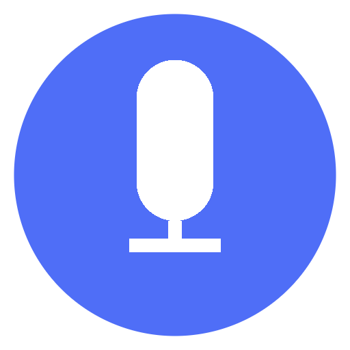

<p align="center">
  <a href="https://wispra-web.vercel.app"></a>
</p>

<h1 align="center">Wispra Mobile</h1>

<p align="center">
  <strong>The iOS and Android app of Wispra, the voice-first way to write.</strong><br>
  Speak instead of type, on every device you work on.
</p>

<p align="center">
  <a href="https://wispra-web.vercel.app"><strong>wispra-web.vercel.app</strong></a>
</p>

<p align="center">
  <a href="https://wispra-web.vercel.app">Website</a> ·
  <a href="https://github.com/sinhgiang/wispra">Desktop app</a> ·
  <a href="https://github.com/sinhgiang/wispra/releases">Downloads</a> ·
  <a href="https://github.com/sinhgiang/wispra/issues">Report an issue</a>
</p>

---

Wispra turns speech into clean, punctuated text. On Windows and macOS it already works today: press one hotkey,
speak in any of 95+ languages, and the polished text is typed wherever your cursor is. Wispra Mobile is the
companion app for iOS and Android, built with Expo and React Native, that brings Wispra to the phone.

> **Project status: early development.** This repository currently contains the app foundation: the Expo project,
> file-based navigation, light and dark theming, app identifiers and the EAS build profiles for iOS and Android.
> Recording, transcription and summaries are **not implemented in the mobile app yet**, and the app is not
> published on the App Store or Google Play. Everything this README describes as available today is either in
> this repository or in the shipping Wispra desktop app, and is labelled as such.

**Try Wispra today at [wispra-web.vercel.app](https://wispra-web.vercel.app)** — free desktop app for Windows and
macOS.

## Table of contents

- [The problem](#the-problem)
- [How Wispra solves it](#how-wispra-solves-it)
- [Who it is for](#who-it-is-for)
- [Features](#features)
  - [In this repository today](#in-this-repository-today)
  - [In the Wispra desktop app today](#in-the-wispra-desktop-app-today)
  - [Planned for mobile](#planned-for-mobile)
- [How it works, step by step](#how-it-works-step-by-step)
- [Platforms and build profiles](#platforms-and-build-profiles)
- [FAQ](#faq)
- [Tech stack](#tech-stack)
- [Repository](#repository)
- [Get started](#get-started)

## The problem

Most people think and speak far faster than they type. Emails, meeting notes, chat replies and first drafts all
pass through the keyboard, and the keyboard is the bottleneck. On a phone it is worse: a thumb keyboard is slow,
error-prone and tiring for anything longer than a few sentences.

Built-in dictation exists, but it rarely solves the problem:

- **Raw transcripts are not finished text.** Filler words, missing punctuation and run-on sentences have to be
  cleaned up by hand, which cancels much of the time saved.
- **Language support is uneven.** People who work in more than one language have to switch settings, or give up.
- **Privacy is unclear.** It is often hard to tell where the audio goes and whether it is kept.
- **It does not follow you.** A good setup on the computer does nothing for the ideas, conversations and meetings
  that happen away from the desk.

## How Wispra solves it

Wispra treats dictation as writing, not as transcription:

1. **One action to start.** On the desktop, a single global hotkey (Ctrl+Shift+Space) opens a small floating
   microphone near the cursor, in any app.
2. **Speech-to-text in any language.** Audio is transcribed by Whisper Large v3 Turbo running on Groq, with the
   language detected automatically, including switching mid-sentence.
3. **AI clean-up before you see it.** Filler words are removed, grammar is fixed and punctuation is added, so what
   arrives is ready to send.
4. **The text lands where you need it.** It is typed straight into the focused text field, without copy-paste or
   window switching, and the clipboard is restored afterwards.
5. **Your key, your data.** Wispra runs on your own free Groq API key. Audio goes from your microphone to Groq and
   back; Wispra itself does not store your voice or your text.

Wispra Mobile exists to carry the same idea to iOS and Android, so that voice-first writing is not limited to the
desktop. Its foundation is in this repository; the voice features are still to be built.

## Who it is for

- **Professionals and managers** whose day is filled with emails, meeting notes and chat replies.
- **Writers and content creators** who want to draft at the speed of thought and get finished sentences, not raw
  transcription.
- **Developers and power users** who want to dictate without leaving their editor, terminal or browser.
- **Multilingual teams** who speak, and write, in more than one language.
- **Contributors** who want to help build the mobile app on a modern Expo and React Native stack.

## Features

### In this repository today

**Cross-platform Expo app.** One TypeScript codebase that targets iOS, Android and the web, on Expo SDK 57 with
React Native 0.86 and React 19.

**File-based navigation.** Screens live in `src/app` and are routed by Expo Router, with typed routes enabled.
Native tabs are used on iOS and Android, and a dedicated tab layout on the web.

**Light and dark mode.** Colours follow the system appearance through a shared theme (`src/constants/theme.ts`)
and themed text and view components.

**Modern React setup.** The React Compiler is enabled, along with Reanimated, Gesture Handler and safe-area
handling for smooth, notch-aware UI.

**Release pipeline ready.** App identifiers are set for both stores (`com.sinhgiang.wispramobile`), and EAS Build
has development, preview and production profiles, with remote app versioning and automatic build-number
increments for production.

### In the Wispra desktop app today

These features ship in the [Wispra desktop app](https://github.com/sinhgiang/wispra) for Windows and macOS, and
define what the mobile app is meant to match:

- **Works in any app.** Gmail, Slack, VS Code, Word, Notion, the browser, the terminal: any text field on screen.
- **95+ languages, auto-detected.** No language toggles; switching mid-sentence is fine.
- **One hotkey, zero setup.** Ctrl+Shift+Space from anywhere, with a floating microphone near the cursor.
- **AI clean-up.** Filler words removed, grammar fixed, punctuation added before the text is typed.
- **Clipboard-safe.** Your clipboard content is restored after each dictation.
- **History.** Review and copy recent dictations.
- **Configurable.** Custom hotkey, pinned language, launch at login and auto-stop.
- **Privacy-first.** No account required, audio is not stored by Wispra, and it runs on your own API key.

### Planned for mobile

Not available yet. The direction for Wispra Mobile is to let people record speech and meetings on the phone and
get an AI transcript and summary. Features will be listed under [In this repository
today](#in-this-repository-today) only once they are built.

## How it works, step by step

**Using Wispra today (desktop):**

1. **Download** Wispra for Windows or macOS from [wispra-web.vercel.app](https://wispra-web.vercel.app).
2. **Get a free Groq API key** at [console.groq.com](https://console.groq.com). It takes about 30 seconds and no
   credit card.
3. **Paste the key** into Wispra's Settings.
4. **Press Ctrl+Shift+Space** in any app. A floating microphone appears near your cursor.
5. **Speak naturally,** in any language.
6. **Press the hotkey again.** The text is transcribed, cleaned up and typed where your cursor is.

**Building the mobile app (this repository):**

1. Install the dependencies and start the Expo development server.
2. Open the app in a development build, an Android emulator, an iOS simulator or the browser.
3. Edit screens in `src/app`; changes reload instantly.
4. Produce installable builds with EAS Build, using the profiles below.

## Platforms and build profiles

| Area | Status |
|---|---|
| iOS | Supported by the codebase; bundle identifier `com.sinhgiang.wispramobile` |
| Android | Supported by the codebase; package `com.sinhgiang.wispramobile` |
| Web | Supported by the codebase (static output) |
| App Store / Google Play | Not published |

| EAS profile | Purpose |
|---|---|
| `development` | Development client, internal distribution |
| `preview` | Internal distribution; Android builds an installable APK |
| `production` | Store-ready builds, build number incremented automatically |

## FAQ

**Can I use Wispra on my phone today?**
Not yet. Wispra Mobile is in early development and is not on the App Store or Google Play. Wispra is available
today on Windows and macOS.

**Is Wispra free?**
Yes. Wispra is free to download and use with your own Groq API key. Groq's free tier covers everyday dictation, and
signing up needs no credit card.

**Why do I need a Groq API key?**
Groq runs the speech-to-text model that makes Wispra fast and accurate. Using your own key means your audio goes
directly to Groq and back, not through Wispra's servers.

**Which languages are supported?**
95+ languages through Whisper Large v3 Turbo, including English, Spanish, French, German, Japanese, Chinese, Korean
and Portuguese, all detected automatically.

**Is my voice stored anywhere?**
Wispra does not record, store or see your audio or text. Audio is sent to Groq for transcription.

**Do I need an account?**
No. The desktop app works without a Wispra account.

**Can I contribute to the mobile app?**
Yes. Read the [Get started](#get-started) section, and open an issue or a pull request on this repository.

More answers are on [wispra-web.vercel.app](https://wispra-web.vercel.app). Problems with the desktop app can be
reported on [GitHub Issues](https://github.com/sinhgiang/wispra/issues).

## Tech stack

| Layer | Technology |
|---|---|
| Framework | Expo SDK 57, React Native 0.86, React 19, TypeScript |
| Navigation | Expo Router (file-based, typed routes, native tabs) |
| UI and motion | React Native Reanimated, Gesture Handler, Safe Area Context, Expo Image, Expo Symbols, Expo UI |
| Compiler | React Compiler |
| Web | React Native Web, static output |
| Builds and releases | EAS Build and EAS Submit |

Related Wispra projects:

- [sinhgiang/wispra](https://github.com/sinhgiang/wispra): the desktop app (Electron, React, TypeScript; Whisper on
  Groq).
- [sinhgiang/wispra-web](https://github.com/sinhgiang/wispra-web): the website and cloud backend (Next.js, Supabase,
  Vercel).

## Repository

```
src/
  app/          Screens and routes (Expo Router)
  components/   Shared UI components, including themed text and views
  constants/    Theme colours and spacing
  hooks/        Colour-scheme and theme hooks
assets/         App icons, splash screen, tab icons and brand images
app.json        Expo configuration (identifiers, plugins, experiments)
eas.json        EAS Build and Submit profiles
```

The project was generated from the Expo starter template, and the `LICENSE` file is the template's MIT licence.

## Get started

Requirements: Node.js with npm. For device builds, an [Expo](https://expo.dev) account and the EAS CLI.

1. Clone the repository and install the dependencies:

   ```bash
   git clone https://github.com/sinhgiang/wispra-mobile.git
   cd wispra-mobile
   npm install
   ```

2. Start the development server:

   ```bash
   npx expo start
   ```

   From there you can open the app in a
   [development build](https://docs.expo.dev/develop/development-builds/introduction/), an
   [Android emulator](https://docs.expo.dev/workflow/android-studio-emulator/), an
   [iOS simulator](https://docs.expo.dev/workflow/ios-simulator/) or the browser (`npm run web`).

3. Lint the code:

   ```bash
   npm run lint
   ```

4. Build with EAS:

   ```bash
   npx eas-cli build --profile preview --platform android
   ```

To use Wispra right now, download the desktop app at **[wispra-web.vercel.app](https://wispra-web.vercel.app)**.
